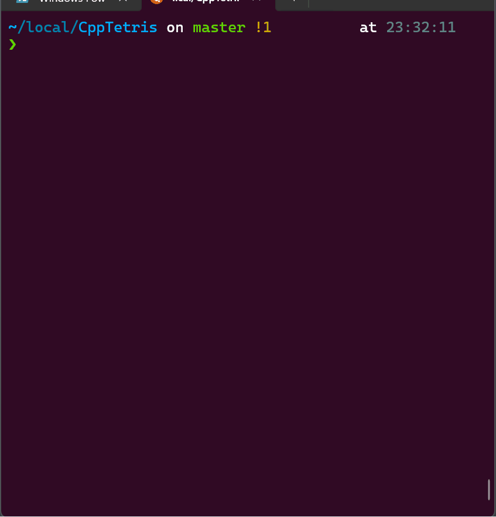

# C++23 Tetris Game

A modern implementation of the classic Tetris game using C++23 and SDL2.



## Features

- Modern C++23 implementation with smart pointers and format strings
- Colorful graphics with 3D-like block effects
- Ghost piece projection showing where the current piece will land
- Preview of the next tetromino
- Increasing difficulty with level progression
- Score multipliers for clearing multiple lines at once
- Smooth controls with wall kicks for rotation

## Controls

- **Left/Right Arrows**: Move tetromino horizontally
- **Up Arrow**: Rotate tetromino
- **Down Arrow**: Soft drop (move down faster)
- **Space**: Hard drop (instantly place at the bottom)
- **Enter**: Restart after game over

## Requirements

- C++23 compatible compiler (GCC 12+, Clang 15+, MSVC 19.32+)
- SDL2 and SDL2\_ttf libraries
- CMake 3.14 or higher

## Building from Source

### Using Makefile (Recommended)

The project includes a simple Makefile for common operations:

```bash
# Install dependencies (Ubuntu/Debian example)
sudo apt install build-essential cmake libsdl2-dev libsdl2-ttf-dev libsdl2-mixer-dev

# Clone this repository
git clone https://github.com/yourusername/CppTetris.git
cd CppTetris

# Build the project
make build

# Run the game
make game

# Run the tests
make test

# Run tests with simplified output (no SDL errors)
make test-mock

# Clean build artifacts
make clean
```

### Manual Build (Linux/macOS)

```bash
# Install dependencies (Ubuntu/Debian example)
sudo apt install build-essential cmake libsdl2-dev libsdl2-ttf-dev libsdl2-mixer-dev

# Clone this repository
git clone https://github.com/yourusername/CppTetris.git
cd CppTetris

# Create build directory
mkdir build && cd build

# Configure and build
cmake ..
cmake --build .

# Run the game
./tetris
```

### Windows (with MSVC)

```cmd
# Clone the repository
git clone https://github.com/yourusername/CppTetris.git
cd CppTetris

# Create build directory
mkdir build
cd build

# Configure and build with CMake
cmake ..
cmake --build . --config Release

# Run the game
Release\tetris.exe
```

## Project Structure

The project uses a modular architecture with functionality separated into specialized files:

```
.
├── CMakeLists.txt         # Main CMake configuration
├── LICENSE
├── Makefile               # Simple Makefile for common operations
├── Readme.md
├── download-sounds.sh     # Helper script to download sound effects
├── include/               # Header files
│   ├── Color.h
│   ├── Constants.h        # Game constants and configuration
│   ├── Game.h             # Main game class
│   ├── GameRenderer.h
│   ├── GameState.h
│   ├── InputHandler.h     # Handles SDL events
│   ├── Renderer.h
│   ├── SoundManager.h
│   ├── Tetromino.h        # Tetromino logic
│   ├── TetrominoManager.h # Manages active and next tetrominos
│   └── TetrominoType.h    # Defines tetromino shapes
├── resources/             # Game resources
│   ├── Tetris.gif
│   ├── fonts/
│   │   └── Arial.ttf
│   └── sounds/
│       ├── clear.wav
│       ├── drop.wav
│       ├── gameover.wav
│       ├── levelup.wav
│       └── rotate.wav
├── run_tests.sh           # Script for running all tests
├── setup-audio.sh         # Script for setting up audio on Linux
├── src/                   # Source files
│   ├── Color.cpp
│   ├── Game.cpp           # Main game implementation
│   ├── GameRenderer.cpp
│   ├── InputHandler.cpp
│   ├── Renderer.cpp
│   ├── SoundManager.cpp
│   ├── Tetromino.cpp
│   ├── TetrominoManager.cpp
│   └── main.cpp
├── tests/                 # Test files using Google Test
│   ├── CMakeLists.txt
│   ├── game_test.cpp
│   ├── grid_collision_test.cpp
│   ├── run_mock_tests.sh
│   ├── test_helpers.h
│   ├── tetromino_manager_test.cpp
│   └── tetromino_test.cpp
├── tidy                   # Scripts for code tidying
├── tidy.sh
└── wsl-sound.sh           # Script for WSL audio setup
```

## Testing

The project includes a comprehensive test suite using Google Test. Tests cover:

- Tetromino behavior, rotation, and collisions
- Game state management and transitions
- Grid operations and collision detection
- TetrominoManager functionality for piece placement and line clearing

To run the tests:

```bash
# Run all tests with default CTest output
make test

# Run tests with simplified output (suppresses SDL errors)
make test-mock
# or directly:
./tests/run_mock_tests.sh
```

The test suite is organized into several test files:

- `tetromino_test.cpp`: Tests for basic tetromino functionality
- `tetromino_manager_test.cpp`: Tests for tetromino management and scoring
- `game_test.cpp`: Tests for game state and core game functionality
- `grid_collision_test.cpp`: Tests specifically for grid boundaries and collisions

## Acknowledgments

- Original Tetris game created by Alexey Pajitnov
- SDL2 developers for the excellent graphics library
- Google Test developers for the testing framework

## License

MIT